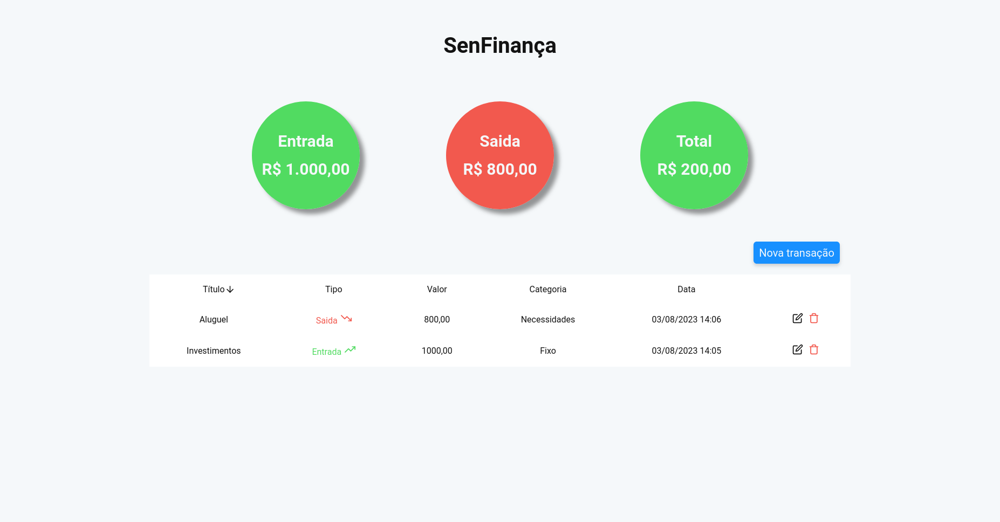
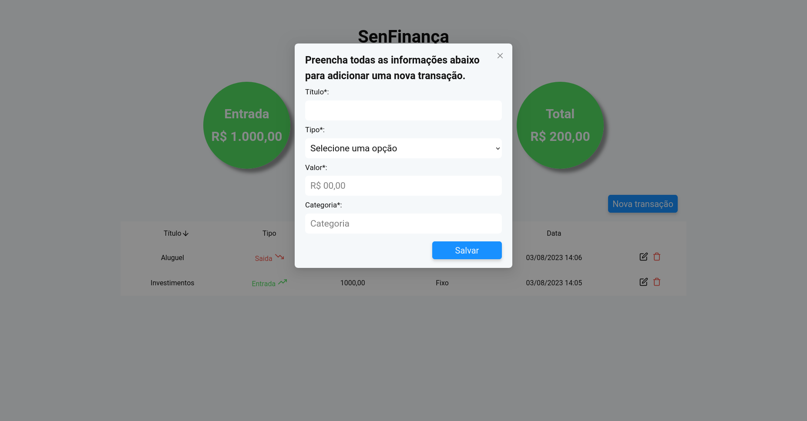

# SenFinança

O projeto consiste em duas paginas, na primeira é exibido um campo de busca onde pode ser feito o filtro de heróis pelo seu nome, quadrinho que participou e serie que participou, ao lado, é possível ver a lista de heróis que são compatíveis com os filtros selecionados, com o seu nome, descrição, foto e também avaliar de um a cinco o quanto você gosta daquele herói.

Já na segunda pagina, você pode visualizar todos os personagens que foram avaliados, filtrar por nome e a nota mínima que foi dada a ele, também é permitido excluir a avalição dada a um personagem especifico ou excluir todas as avaliações.





<!-- ## Deploy da aplicação

O projeto está no ar no seguinte link:

https://marvel-heroes-7o50s34l3-m4ty21.vercel.app/ -->

## Clone o repositório e instale as dependências

Para rodar o projeto é preciso ter instalado o Node.Js e as dependências usadas.

### Instalando Node.Js

Instale siguindo as instruções na [Documentação do Node.Js](https://nodejs.org/pt-br/download/).

### Clonando o repositório

Com método HTTPS:

```git
  git clone https://github.com/matheusmouraa/test-sensedata.git
```

Com método SSH:

```git
  git clone git@github.com:matheusmouraa/test-sensedata.git
```

Depois, acesse a pasta do repositório pelo terminal:

```bash
  cd test-sensedata
```

### Instalando as dependências

Agora, instale todas bibliotecas e dependências do projeto:

```bash
  npm install
```

## Rodando projeto

Após clonar o repositório e instalar as dependências necessárias, para rodar o projeto basta usar o seguinte comando:

```bash
  npm start run
```

## Tecnologias e bibliotecas utilizadas

- React
- Testing-Libary
- Styled-components
- Formik
- Jest
- AntD
- Yup
- Moment
